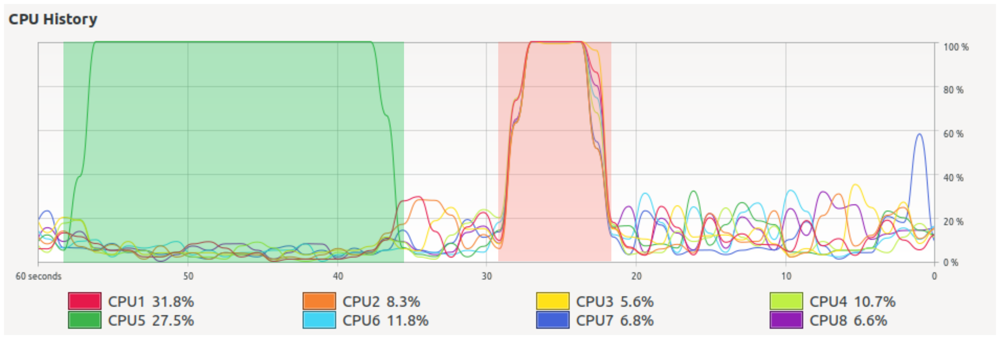

```{r setup, include=FALSE}
knitr::opts_chunk$set(echo = TRUE)
```

Loops are, by definition, repetitive tasks. If the tasks are complex, or if the number of repetitions is high, loops may take a lot of time to run. There are several strategies to increase the execution speed of loops. In this short tutorial we will talk about one of them: parallelization.

## Prerequisites

This tutorial is self-contained. Some libraries may be required. If you are missing any, you can install it running `install.package('<library-name>')`, where `<library-name>` stands for the name of the library (for instance, `install.package('parallel')`).

If you prefer to execute it line-by-line, please visit the [vignette version]([vignette version](https://github.com/PabRod/blog-parallelR)).

## Why parallelizing?

Modern laptops typically have 4 or 8 cores. Each of them can be loosely thought of as an independent mini-computer, capable of doing tasks independently of the other ones. The number of cores in your computer can be retrieved from `R` with the command:

```{r number-cores}
numCores <- parallel::detectCores() # Requires library(parallel)
print(numCores)
```

When a program runs serial (as they usually do by default), only one core is recruited for performing the program's task. Recruiting more than one core for a given task is known as parallelization. The desired result of parallelizing a task is a reduction in its execution time. An analogy could be to build a wall by laying bricks alone, one by one (serial) as opposed to building it with the help of three friends (parallel with 4 "cores").

In the figure below, we see the CPU usage over time of my computer performing the same task serial (highlighted in green) and parallel (red). Both processes performed the very same task and produced the same result, but the parallel one, recruting more cores, run three times faster.



It may be surprising to notice that using 8 cores instead of one didn't multiply the speed by 8. This is normal, parallelization rarely behaves as linearly as we would like. A reason for this is that the code, the input, and often also the data, has to be copied to each of the cores. The output of each core also has to be put together, and this also consumes time. Following the analogy of the 4 brick-layers, it is clear that building a wall with friends requires a bit of planning and coordination before starting laying the bricks (at least if we want the wall to be one wall, and not four disconnected pieces). Intuition also tells us that, while perhaps asking for the help of 4 friends may be a good idea, calling 256 friends could be an organizational nightmare. For a more formal approach to these ideas, check [Amdahl's law](https://en.wikipedia.org/wiki/Amdahl%27s_law).

More importantly, some repetitive tasks are not parallelizable at all. For instance, what if instead of a brick wall we want to make a brick stack? There is no point of laying the 3rd brick if the 1st and 2nd are not there already!

But don't worry about these details now. The example I've prepared for you is going to work fine.

## We need a task to do
In this short introduction, I want to show different approaches, some of them serial and some of them parallel, to approach a parallelizable problem. A good example task for showing the advantages of parallelization would be one that:

1. Is simple.
2. Takes an appreciable amount of CPU time to be completed.

The problem of [deciding if a large integer is prime or not](https://en.wikipedia.org/wiki/Primality_test) fulfills both charachteristics.

It will be a good idea to split our task into a function (describing WHAT to do) ...

```{r define-fun}

fun <- function(x) {
  numbers::isPrime(x) # Requires the package numbers
}
```

... and an input (describing to WHOM).

```{r define-input}
# Generate some large integers
N <- 1000 # Number of integers
min <- 100000 # Lower bound
max <- 10000000000 # Upper bound

inputs <- sample(min:max, N) # List of N random large integers (between 1e5 and 1e10)
```

These two objects, `fun` and `inputs`, define the _homeworks_ we want to assign to our computer (in this case, to decide which integers from the list of inputs are prime). We also want our computer to store the results. We will do this in six different ways, two of them parallel. Later, we'll compare their performance.

### A note about the examples

Please note that, in the following examples, the structure below just times whatever `<code>` is between the braces, and has nothing to do with the parallelization.

```
system.time({

  <code>

}) -> execution_time
```

## Possibility 0: run serial

In this section we'll see three different ways of solving our problem running serial. That is, without using parallelization. The user is likely to be familiar with at least some of them.

### 0.1 Run serial with a loop

```{r serial-loop}
system.time({

  results <- rep(NA, N) # Initialize results vector  
  for (i in 1:N) { # Loop one by one along the input elements
    results[i] <- fun(inputs[i])
  }

}) -> time_serial_loop
```

### 0.2 Run serial with `foreach`
This command avoids us explicit typing of the index (compare with the `for` loop in the previous example). The output of `foreach` is, by default, a list. We used the parameter `.combine = "c"` (concatenate) to return the output as a vector.

```{r serial-foreach}
# Load the required libraries
library(foreach)

system.time({

  foreach (val = inputs, .combine = "c") %do% { # Loop one by one using foreach
    fun(val)
  } -> results

}) -> time_serial_foreach
```

### 0.3 Run serial with `lapply`

`lapply` is usually preferred over explicit `for` or `foreach` loops.

```{r serial-lapply}
system.time({

  results <- lapply(inputs, fun) # Hide your loop with an lapply function

}) -> time_serial_lapply
```


## Do it parallel!

And now, we'll finally use parallel programming to solve our problem.

### Possibility 1: run parallel with `mclapply` (Linux only)

`mclapply` is part of the `parallel` library. Rule of thumb: use it instead of `lapply`. If the code is parallelizable, it will do the magic:

```{r mclapply}
# Load the required libraries
library(parallel)

# Run parallel
system.time({

  results <- mclapply(inputs, fun, mc.cores = numCores) # Note that the number of cores is required by mclapply

}) -> time_mclapply
```

Unfortunately, this approach only works on Linux. If you are working on a Windows machine, it will perform as a serial `lapply`.

### Possibility 2: run parallel with `doParallel` + `foreach`

Rule of thumb: `doParallel` transforms a `foreach` loop into a parallel process. Provided, of course, the underlying process is parallelizable.

```{r doParallel}
# Load the required libraries
library(iterators)
library(doParallel)

# Initialize
registerDoParallel(numCores)

# Loop
system.time({

  foreach(val = inputs, .combine = "c") %dopar% {
    fun(val)
  } -> results

}) -> time_doParallel
```

## Possibility 3: take advantage of vector functions

Most (but not all) of `R` functions can work with vectorized inputs. This means that the function accepts a vector of inputs and returns an equally-sized vector of outputs. This allows to _hide_ the whole _loop_ in a single, easy to read line.

```{r serial-vector}
system.time({

  results <- fun(inputs)

}) -> time_vector
```

More importantly, although running serial, vector functions often overperform parallel schemes. Why not use them always then? The quick answer is: we are not always lucky enough to have a function that admits a vector input.

## Compare results

By plotting the execution times, we notice that the parallel methods performed significantly better than the serial ones. We also notice that the vector method performed even better (but keep in mind not all functions are vectorizable).

```{r echo=FALSE, message=FALSE, warning=FALSE}
i <- 3
times_df <- data.frame(
  case = c("0.1 Loop", "0.2 foreach", "0.3 lapply", "1 mclapply", "2 doParallel", "3 Vector"),
  time = c(time_serial_loop[i], time_serial_foreach[i], time_serial_lapply[i], time_mclapply[i], time_doParallel[i], time_vector[i]),
  mode = c("Serial", "Serial", "Serial", "Parallel", "Parallel", "Serial vectorized"),
  stringsAsFactors = TRUE
)

library(ggplot2)
ggplot(times_df, aes(x = case, y = time, fill = mode)) + geom_bar(stat = "identity") + labs(x = "", y = "time (s)", fill = "")
```

Check a table below for a quick overview of each method:

{ width=50% }

## Trying to parallelize non-parallelizable code

In this subsection we'll use the iterator below as an example:

$$
x_{n} = x_{n-1} + 1
$$

It is easy to see that, when initialized with $x_{0} = 0$, this iterator yields $\{0, 1, 2, 3, 4, ...\}$. Note that in order to obtain the value of element $n$ (i.e.: $x_n$), the value of the previous x (i.e.: $x_{n-1}$) is required (remember the analogy of building a stack of bricks). This operation is thus intrinsically serial, paralellizing it would be the computational analogy of beginning to build a house from the roof.

```{r}
fun <- function(x) {x + 1}

N <- 6
inputs <- rep(NA, N) # Initialize as (0, NA, NA, ..., NA)
inputs[1] <- 0
```

Using a serial loop everything works fine:

```{r, results='hide'}
foreach(i = 2:N) %do% {
  inputs[i] <- fun(inputs[i-1])
}
```

```{r, echo=FALSE}
print(inputs) # This hidden chunk just creates a nicer output
```

But what if we insist on parallelizing? After all, our serial loop is very similar to the `foreach` + `doParallel` one, so it is tempting to at least try.

And what happens then? As expected, it simply doesn't work properly. And more worryingly, doesn't throw an error either!

```{r, results='hide'}
inputs <- rep(NA, N) # Initialize again
inputs[1] <- 0

foreach(i = 2:N) %dopar% {
  inputs[i] <- fun(inputs[i-1])
}
```

```{r, echo=FALSE}
print(inputs) # This hidden chunk just creates a nicer output
```

## Notes

The astute reader may have noticed that our function `fun` is a mere renaming of the function `isPrime` contained in the package `numbers`. The reason for that is merely pedagogical: we want the readers to:

1. Notice that the structure input -> function -> results is indeed VERY general.
2. Be able to try their own pieces of slow code inside the body of `fun` (this can be done comfortably using our [vignette](https://github.com/PabRod/blog-parallelR).
